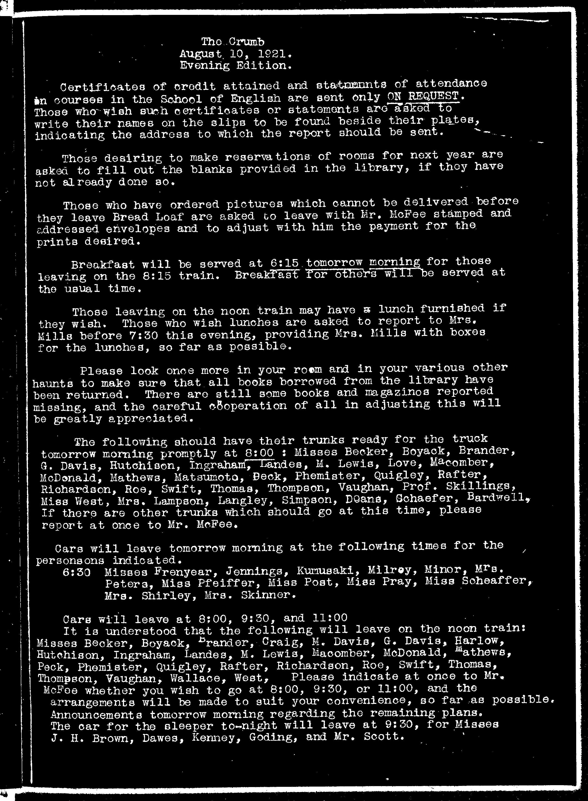
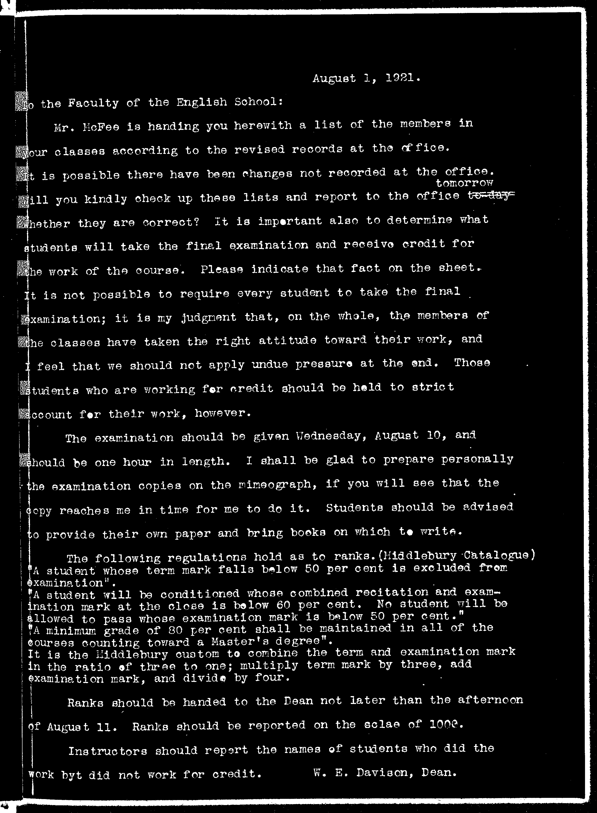
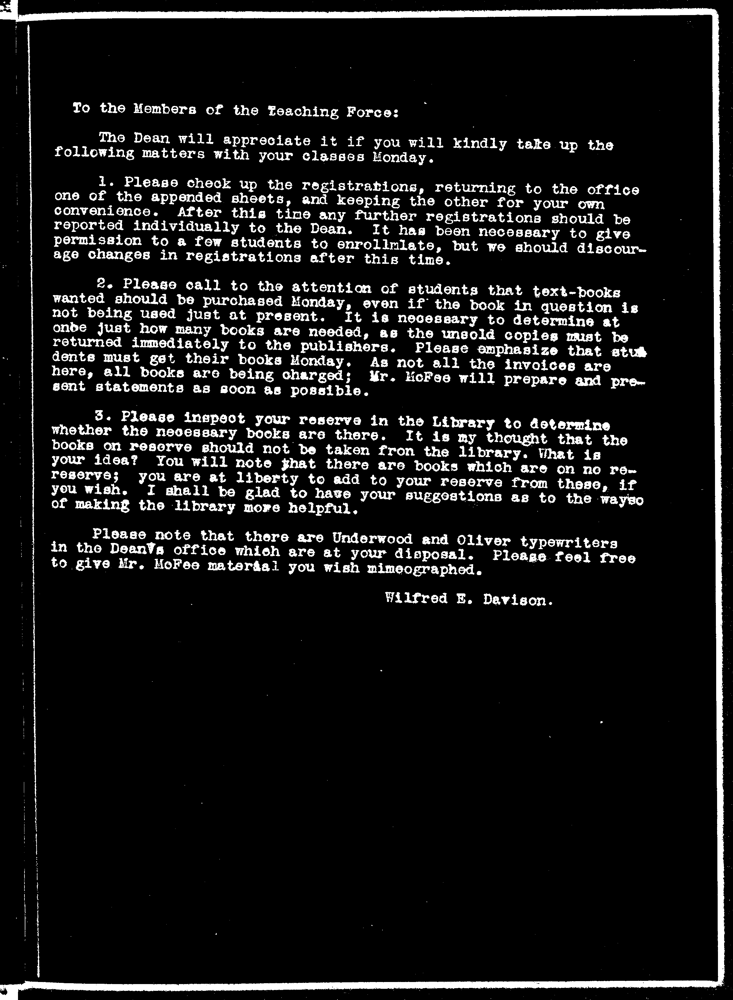
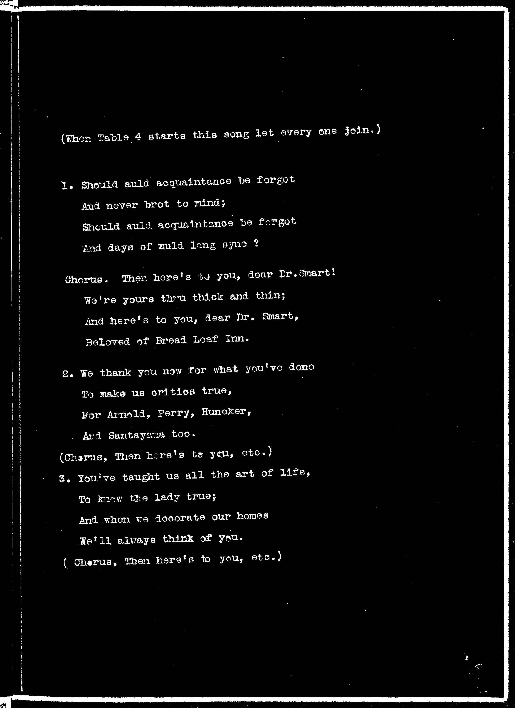
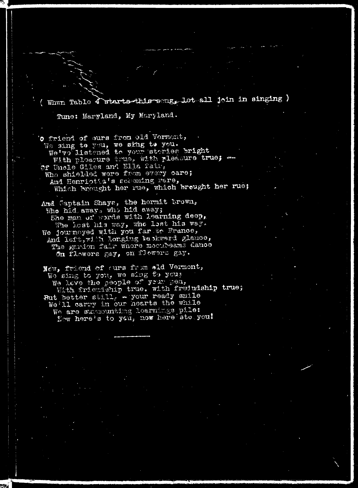
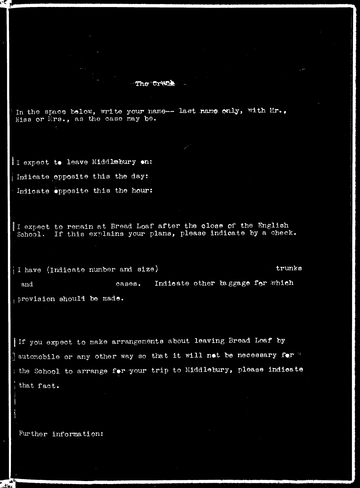
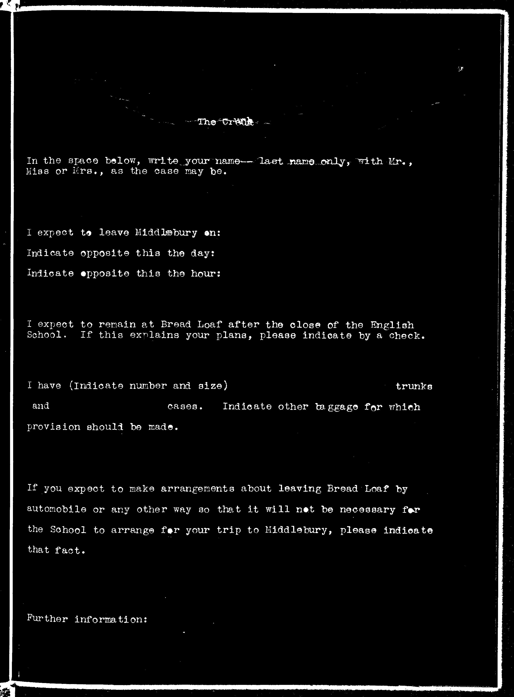
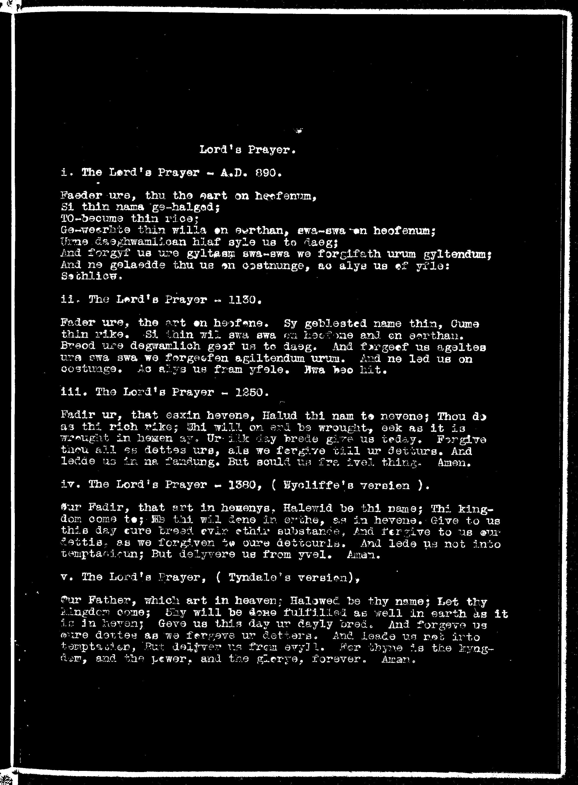
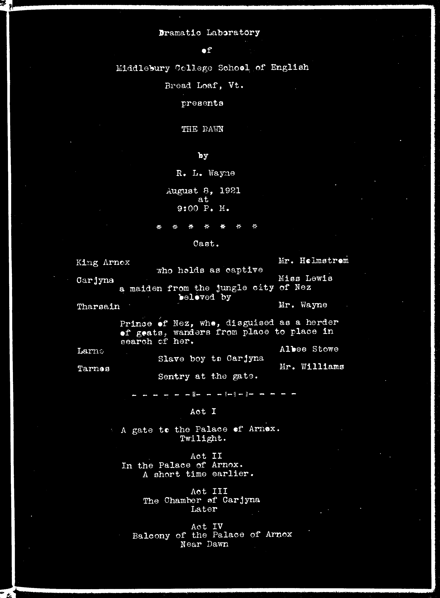

<!-- page: 1 -->
[illegible]

<!-- page: 2 -->
MIDDLEBURY COLLEGE

THE EGBERT STARR LIBRARY

ARCHIVES
AZG
1
FE j
arme|

<!-- page: 3 -->
The Crumb
August 2, 1928

You will all be delighted to learn that Miss Cather and Miss Lewis are to remain at Bread Loaf until Sunday.

Be sure to make your plans so that you can hear Miss Futterer in "Rosalind" by Barrie and Miss Ramsey in a program of songs. Surely we all appreciate greatly the generous courtesy being extended to the School, and we should show our appreciation by attending to the last Breadloafer at Eight O'clock.

Mr. James H. Burckes, who has charge of the Photograph Exchange, will be at the Bookstore between 5:30 and 6:00 to-day to deliver prints of the pictures taken of the first play. Proofs of other play pictures will be possessed in the exhibit at the Burexes hour indicated. Be sure to see Mr. Burexes. Exhibit Two is being posted to-day. This exhibit includes some pictures which were put up in Exhibit One, as it has been suggested that some would like to see all the available pictures of Mrs. Markham and others before placing their order. If you like some of the new prints better than those you ordered, you are at liberty to cross off your first order. When you turn in your films for loan to the Exchange, please put them in an envelope and write your name upon it. All those who had pictures up in Exhibit One please hand in to [illegible] the envelopes for those pictures, if they have not done so already. Please leave the envelopes on the Dean's desk.

The Crumb has been requested to call attention to two pamphlets which may be found on the bookcase containing the Exhibit Library. These pamphlets are of particular interest to teachers of debating. They are brief sketches in pamphlet form on "Immigration and Americanization" and "Our Foreign Policy and The Monroe Doctrine", and are arranged with references to collateral reading on each point of debate. The pamphlets are of especial interest in that the authors, Miss E. Loughran of Roxbury High School, Boston (collaborating with M.R. Maddox of Erasmus High School, Brooklyn) is a student this summer at the Parish School. The pamphlets were published in 1929 and were used in 750 high schools and colleges during the last school year. Mr. Huggard will be glad to take orders for the pamphlets. The price is 40¢ each.

The Crumb has been requested to print the following Notices:

Tomorrow night, from 6:00 to 10:50 a Frankfurt roast will be carried on by the Boy Scouts of Ripton for the benefit of the Community House at Ripton village. The roast will be held on the hill side of the village, where the sharp gravel promontory is, just before reaching the bridge at this end of the village; turn up the road to the right. All those connected with the Summer School or the Inn who may be interested are invited to come. Here is a chance to have a good time and help a good cause at a reasonable price.

The minister at Ripton is a young man who is a student at Middlebury. Valiant efforts have been made recently in the "little village" to equip a Community House. The Crumb wonders whether members of the School interested in the rural problem may care to consider offering some form of entertainment as soon as possible for the village. This query is made purely upon the initiative of the Crumb.

<!-- page: 4 -->
The Grumb.
July 1, 1922

This evening at eight o'clock in the Music Hall Professor Charles
B. Wright will lecture on "The Present Worth of Poetry". All are
cordially invited.

Tomorrow (Saturday) afternoon there will be an expedition to
Lake Pleiad, leaving the Inn at two o'clock and returning in time
for supper. Distances about three miles each way—a total of six
or seven miles, most of it on the carriage road and the rest on an
easy trail. All are cordially invited to participate. No need
of special clothing or YMCA Shoes. All who would like to go are
asked to meet in front of the Inn promptly at 2:00 P.M., Saturday.
This is another expedition in addition to the two
expeditions already announced.

Hikes for the present weekend have been planned to Emily Proctor
Lodge on Bread Loaf Mountain and to Lincoln Mountain. The start
will be made on both hikes on Saturday morning after breakfast. The
night will be spent at the shelters and the return made on Sunday
afternoon. To Emily Proctor Lodge and return is about 16 miles.
Automobiles will take the Lincoln Mountain party to the foot of the
mountain. The distance to the shelter is three miles, so that the
total walking distance will not be more than eight miles. There are
still two places open on the Lincoln Mountain hike. Inquiries and
applications should be made to either Prof. or Mrs. Harrington, or
Prof. Skillings.

There will be a Vesper Service Sunday afternoon at five. Dr. Geo.
T. Smart will preach. Everyone at Bread Loaf is invited.

Students who have taken books from the library are asked to
return them temporarily this evening in order that certain lists
may be checked up.
Those who have not registered are asked to see Mr. Davison at
his office after supper tonight or tomorrow at nine o'clock.

Students who desire laundry service through the Middlebury Steam
Laundry may give their names to Mr. McFee and get price lists. Laundry sent Mondays will be returned Fridays.

<!-- page: 5 -->
"The Second"
July 5, 1922

The Dean will be in his office Monday from 8:00 to 8:30, from 9:30 to 10:30 and from 1:30 to 2:50 to consult with any students who have not yet registered. It is requested that all who have registered report at one of the hours indicated.

Students wishing to make changes in their registrations should consult the Dean on Monday at one of the office hours indicated.

The text-books are to be had at the library, except Ward's "What is English", Lewis's "American Speech", and "Browning". As soon as the remaining books come, notice will be given.

Students should get their books from the library Monday, without fail, as it is necessary to return at once to the publishers all unsold copies. As the invoices have not all been received, all books are being charged. Mr. McFoe will present statements as soon as they are ready.

Mr. Fullington will conduct a short walk Monday afternoon at 3:30. Those desiring to take the walk should report on the front porch promptly at 3:50.

Announcement will be made shortly regarding the arrangements for the use of the library. Meanwhile students are requested not to take out books without the proper record being made by the person in charge of the library.

<!-- page: 6 -->
The Crumb — July 4, 1921.

It has been planned to arrange evening entertainments, as a rule, on Monday, Wednesday, and Friday evenings. The intense heat to-day seems to make it inadvisable to schedule an entertainment this evening. On Wednesday evening Mrs. Conkling has consented to read from her poems. On Friday evening Dr. Smart will give a lecture on "The Lady".

The seating assignments at table will be changed weekly on Thursday at noon. The assignments will be determined by lot, one person drawing for all the members of the School. Members of the School will be advised as they enter the dining room Thursday noon of the disposition Fate has made of them. The fortunes of Chance will see to it that a person is not assigned twice to the same table.

The Library will be in charge of Miss West during the morning, of Miss McCaskie and Mr. Fee in the afternoon, and of Mr. McVoe in the evening. Certain books have been placed upon reserve at the request of the instructors. These books should not be borrowed from the library, but should be returned to the shelves as soon as one is through with them. Other books may be taken from the library for a limited time after they have been charged by the person in charge of the library. Attention is called to fiction and other interesting books provided for the convenience of members of the School, also to the magazines and papers to be found in the library.

Attention is called to the change in the hour of the Laboratory in Play Production. This will be held from 1:30 to 2:30, instead of at 4:30 as previously announced. Those not enrolled in the course in Play Production whom are willing to help in acting, making costumes, and getting properties are asked to give their names to Miss Spaulding or Mr. Wayne. It is hoped that the members of the School will cooperate so far as possible to present several short plays during the session of the School.

Attention is again called to the necessity of procuring this evening any further copies of text-books needed. Surplus copies will be returned tomorrow to the publishers.

Until further notice the Dean will be in his office at 9:30, and for a short time after dinner and after supper.

<!-- page: 7 -->
The Crumb.
July 44 1921.

This evening at eight o'clock in the Music Hall Professor Wright will speak on "The Schoolmeester in Life and Literature". He wishes it stated that the presentation will be brief and, as regards its content, mercifully tempered to the temperature.

Those who are going to Emily Proctor Lodge for this week-end are asked to give their names to Miss Mildred Davis; those going to Ward Brook Lodge are asked to give their names to Mrs. Harrington; and those who are going to Clark's Clearing on Saturday are asked to indicate that fact to Mr. Fullington, so that he may know for how many to provide the noonday meal. It will be appreciated if this information may be had to-day.

Students who find it necessary to drop out of a course in which they enrolled should first secure the approval of the Dean. They should then report the matter to the instructor.

All are reminded of the need for thoughtfulness in maintaining a reasonable degree of quiet on the piazzas and in the vicinity of classrooms when classes are in session. It will be greatly appreciated if everyone will cooperate in this matter.

Tomorrow (Friday) evening at 7 eight o'clock Dr. Smart will lecture on "The Lady". Everyone is invited.

<!-- page: 8 -->
The Crumb
July 10, '02

The Vesper Service this week will be held at eight o'clock this evening in the Music Hall. Dr. George T. [illegible] will preach. Everyone at the Inn is cordially invited.

At eight o'clock Monday evening Mr. R. L. Wayne, Stage Manager of The 47 Workshop, will speak on "The Little Theater Movement". All are invited.

The following daily papers are on file in the library:

The New York Times, The Boston Transcript, The Rutland Herald, and The Burlington Free Press.

Attention is called to the exhibit of text-books from various publishers. These books are in the library in a special section.

The Crumb will gladly receive notices of general interest. Notices should be handed to Mr. [illegible] at breakfast. [illegible].

<!-- page: 9 -->
Bread Loaf
July 19, 1920

This (Wednesday) evening at 3:00 Professor Wright will give his lecture on "A Manx Poet". All are invited.

A hike to Pulpit Rock will be conducted by Mr. Fullington Wednesday afternoon, starting from the Inn at 3:00. The round trip is about three miles. Those wishing to go should gather on the front perch promptly at 5:00.

In answer to inquiries, it is announced that final examinations will be conducted August 10. Accordingly, it will be possible for students to leave for their homes on the noon trains Thursday, August 11.

All Breadloafers are invited to a Salmagundi Evening in the Music Hall Thursday evening at 8:00. If you have tears, please shed them before you come.

On Friday evening at 8:00 in the Music Hall, Mrs. Conkling will speak on the life and works of Robert Frost and will read from his poems. The attention of members of the School is called to a short bibliography on Mr. Frost and his work, which will be found in the library. His books are also to be found there. Mr. Frost has indicated that he will arrive at Bread Loaf on Tuesday, July 19. It is expected that he will read from his poems and lecture on his work that evening and that he will lecture on "The Responsibilities of a Teacher of Composition" the following day. Arrangements will be made so that all members of the School can hear both of Mr. Frost's lectures.

The Dean regrets that it is necessary to make the request again that quiet be maintained in the vicinity of classrooms. The weather makes it necessary to leave windows and doors open, and loud conversation and constant passing on the piazzas near the classrooms makes it very difficult for the teachers and students. It will be greatly appreciated if all will cooperate to create conditions under which the best possible work can be done.

Attention of all members of the English School, both Students and Faculty, is called to the remarkable opportunity afforded by the Battell Forest. We are right at the very entrance of this magnificent forest; one piece of it, twenty-seven thousand acres, lies here at the north, east, and south of us, -- its trails almost at the doors of the Inn. Those who care at all for the woods or for out-of-door life will seldom have a chance to get into the woods as easily as here. Because we have come for study, we may take the presence of the woods as a matter of course and let it go at that. Many men and women are on this very day travelling hundreds of miles by train for the sole purpose of walking in forest which is in no way superior, if it can at all equal in variety and interest, the forest which lies here at the doors of Bread Loaf Inn. [illegible section - approximately 4-5 lines of heavily corrupted text]

<!-- page: 10 -->
The Crumb
July 14, 1921

Don't forget
Salmagundi! Eight o'clock in the Music Hall.
You won't be sorry you came instead of studying.

It looks like the best week-end yet. It is likely to be cooler and clear, after this week's rain, and a full moon is due about Saturday night. Two overnight hiking expeditions are planned: one to Bread Loaf Mts and Emily Proctor Lodge, the other to Worth Mt. and Sucker Brook Lodge. All who are interested in these trips are asked to meet in the large parlor at seven o'clock this evening for a few minutes to hear about them and to indicate their wishes in the matter.

It will be greatly appreciated if those who want lunches put up for Saturday will speak with Mrs. Mills about their plans by Friday noon. The necessity of the cooks knowing in advance regarding special plans is apparent.

Tomorrow evening (Friday) at eight o'clock in the Music Hall Mrs. Conkling will speak on "The Life and Art of Robert Frost", reading some of Mr. Frost's poems.

Monday evening Dr. Smart will lecture on "The Decoration of Life". Tuesday evening it is expected that Mr. Frost will read from his poems. Wednesday evening the first play of the season will be presented by the class in Play Production. The play is "Tom Thumb".

Word has been received from Mrs. Dorothy Canfield Fisher that she expects to reach Bread Loaf either Sunday, July 24, or the following morning, and that she will be at Bread Loaf until Wednesday noon, giving three lectures while here. Dates and subjects will be announced later. On Friday, July 22, at eight P. M. Mrs. James Canfield, sister-in-law of Mrs. Fisher, and Mrs. Ruth Murdock Lampson will speak on "The Life and Art of Dorothy Canfield". Several of Mrs. Fisher's best known books are in the library.

We are glad to welcome to the School of English Mr. Frank S. MacGregor, special representative of Houghton Mifflin Company. Mr. MacGregor has in the library an interesting display of text-books for English classes and will be glad to meet and talk with any members of the School who are interested in the Houghton Mifflin publications.

<!-- page: 11 -->
THE CRUMB

This (Monday) evening at eight Dr. Smart will lecture on "The Decoration of Life". Everyone is invited.

Mrs. Mills asks that all members of the School, both students and teachers, who have not done so sign the register at the Inn office. It will be appreciated if this is arranged soon.

Mr. McFee is distributing to-day statements of accounts for text-books and supplies from the bookstore. There are some small charges for express, etc., which are not included on these statements; these he will present later. It will greatly facilitate the balancing of accounts if the bills are settled promptly. Mr. McFee will be at the library for an hour after dinner to-day, from 3:30 until 5:00 and for an hour after supper. These bills should be paid to Mr. McFee in person.

You will find with this issue of The Crumb a printed list of the students in attendance at the Summer Session of Middlebury College, of which the English School is one section. It will be appreciated if you will report to Mr. Davison any errors you discover in the list; he has already discovered some. Mr. McFee's name was omitted from the list of students; there are 83 students in the English School, with the following geographical distribution: Mass.—18; N. Y.—17; Vt.—8; Conn.—7; Iowa, Ohio, and Penn. 4 each; Minn.—3; Wis., R. I., N. H., and Japan, 2 each; Ill. and Md., one each.

Mr. MacGregor will continue his exhibit of English books published by Houghton Mifflin Company to-day and tomorrow morning. It is necessary for Mr. MacGregor to leave Bread Loaf tomorrow noon. Those interested to interview him and see the books he had brought will find him in the library this afternoon and evening and tomorrow morning. He has with him several copies of some books for which there has been considerable demand and will be glad to provide those interested with copies.

Mrs. Conkling, Professor Lewis, and Professor Skillings have kindly consented to act as a committee of award in the "Crumb" contest, and their decision will be announced later. The prize will be a quit-claim deed to a corner lot on Parnassus. (N. B. While The Crumb did not originate this contest and is not managing it, the proposed motto will be heartily welcomed, if one may personify motto and crumb to that degree. Further, The Crumb welcomes contributions of all kinds, and will print them if possible!)

Those in charge of the library request that all taking advantage of it observe carefully the following rules, in order that the library be of the greatest possible use to all concerned.

1. No book may be taken from the library without being properly checked by the person in charge. If no one is in attendance, the book may be taken if the card is left on the table.

2. Reserve books should not be taken from the library to the porches for more than one hour at a time.

3. Reserve books may be taken out at 9:50 P. M., but must be returned by 8:50 the next morning.

4. Books not on the reserve shelves may be taken out for 4 days.

5. Leave books on library table when you return them. Do not return borrowed books to the shelves. The librarian will do that.

<!-- page: 12 -->
The Crumb
July 20, 1921

Mr. Revert Frost will address The English School this morning at 9:28 in the Music Hall. Everyone is cordially invited to be present. Classes scheduled for 9:50 and 10:30 will not meet today.

Guests of the Inn are included, as always for evening entertainments, in the invitation for this morning's lecture and reading.

The evening has been postponed until next week. Further notice will be given those who are to participate. A lecture arranged by Professor Lewis on "Oral English" [illegible] date[d].

It has been found necessary to change the date of the first play from tomorrow evening to Thursday evening. On Thursday evening at eight o'clock "Top Me Thumb" will be presented by the class in Play Production. No entertainment is scheduled for this evening.

On Friday evening Mrs. James Canfield and Mrs. Ruth M. Lampson will speak on "The Life and Work of Dorothy Canfield". Mrs. Fisher has sent word that she expects to arrive at Bread Loaf Sunday.

<!-- page: 13 -->
The Crumb.
July 22, 1991

James Canfield and Mrs. Ruth M. Lampson will speak on "The Life and Work of Dorothy [illegible]" This evening in the eight. Mrs. [illegible] will speak Monday evening. Everyone is invited. Mrs. Fisher's lectures will be announced later. Dates for the other eight will be conducted.

The Vesper Service Sunday evening at [illegible] will be conducted by Dr. Howard D. Collins, Acting President of Middlebury College.

The Dean has been asked whether anyone is interested to know about a search position where the main work is Public Speaking and Dramatics, with some teaching of English to fill out the line. The position is in one of the best schools in New York. Anyone interested to learn further particulars is asked to see the Dean at once.

It has been suggested that a picture exchange be established at the library. Those who have prints which would be of interest to others would do a courtesy that would be much appreciated if they would join the exchange and lend their films. Those who are interested to work out some such plan for exchange pictures of [illegible] are asked to meet in the large parlor to-day at one thirty.

The Crumb has been asked to suggest that the School should have an official Bread Loaf song. The Crumb is glad to second the suggestion most heartily and hopes that such a song will be produced. Unless someone has a better suggestion, why not write a song and hand it to the Dean? He will appoint a committee of award to select the best song contributed. Suggestions will be welcomed.

This afternoon at 2:30 Professor Wright will lecture in course 2 on "The Work of Richard Burton". It has been suggested that some not members of the class might like to attend this lecture. Anyone interested is invited to be present.

The Librarian reports that the following books are past due:
Canfield-- Hillsboro People.
Masefield-- Reynard the Fox
Dryden-- Modern English Drama
Lewis-- Main Street

It will be greatly appreciated if those having these books will return them at once to the library.

Will those who have not arranged with Mr. McFee for the text-books and supplies furnished, for which bill has been rendered, please see him right after dinner to-day? Mr. McFee wishes to balance his books in order to submit statements for books which have come since the first order was delivered. Those who have not yet received statements will be remembered presently.

<!-- page: 14 -->
The Crumb
July 27, 1921

Mrs. Fisher has kindly consented to read to us again this morning at 11:30 in the Music Hall. Arrangements have been made so that the classes regularly scheduled for that hour will be adjourned to-day. Everyone is invited to hear Mrs. Fisher.

This evening at eight the Dramatic Laboratory will present "The Hour Glass". All are invited.

Tomorrow evening Professor Vernon C. Harrington will deliver a lecture on "The King and the Book". On Friday evening Dr. Harrington will give in costume a Browning monologue.

The Dean will be in his office this afternoon at 3:30 to arrange business details with those who wish to see him.

Those who are willing to enter photographs in the Exchange are asked to hand to Mr. McFee to-day the prints they wish to have posted. It is suggested that the owners keep the films until further details of procedure will be announced later. Mine orders have been given.

The Crumb wishes to announce with as much Addisonian suavity as it can muster that the unappreciatively critical notice posted on the front porch is not one of its crimes. Had the quatrain in question been presented to The Crumb, it would have been suitably received! The Crumb insists again that the so-called "Crumb contest" was not instigated by The Crumb, and it gently but firmly refuses to be implicated in the regrettable consequences thereof.

The notice should be accorded the attention it deserves and the perpetrator should be discovered and suitably rewarded.

Mr. McFee requests that those who have not arranged about the statements for books and express see him, if possible, to-day. He will be at the library for an hour after dinner and an hour after supper.

<!-- page: 15 -->
The Crumb.
July 28, 1921.

Last trip to Sucker Brook Lodge. Trail runs along the whole length of Worth Mt. (elevation 3300 feet). Three lookouts—two of the White River Valley and the third a great panorama of mountains to the south. New lodge at the source of Sucker Brook, now in process of building; roof was put on last week. Will be the finest lodge on the whole Long Trail except Tart Lodge on Mt. Mansfield. Good opportunity to see a lodge in process of being built. Return Sunday by going down the brook to Sucker Brook Meadow, and so to Bread Loaf Inn. Easy trip. All who want to go should give their names to-day to Prof. Skillings or to Miss Mildred Davis.

The Crumb is relieved to announce that through the assistance of our local Sherlock Holmes the identity of the mysterious person who conducted the so-called "Crumb contest" has been discovered. He has confessed that not only was he the originator of the contest, but also the unknown author of the quatrain which was awarded the prize. Moreover, it was he who wrote the scathing criticism which is posted beside the front door of the Inn. He had begged so earnestly that his identity be not revealed that The Crumb hesitates to throw the kerosene light of publicity upon his poor, shrinking form. The Crumb feels, however, that something should be done by way of punishment for his having discouraged so many budding poets by the Poe-like criticism to which he confesses; not a lyric warble has been heard since his Edinburgh Review was posted. And The Crumb does most earnestly want a Bread Loaf song. Accordingly, if the budding poets will please go on budding, the Crumb will refrain from further comment on the contest. It is glad to forgive and be forgiven, especially since it knew the identity of the culprit from the beginning and the notices were typed by the little Crumb Devil, whose name does not begin with Mc. The best part of the joke, however, we may not publish: the oral comment of the committee of choice when they made known to the originator, engineer, and prize-winner of the contest their opinion of his "poetry, verse, or worse."

Orders are being taken at the library for copies of the pictures taken of "top o' the Thumb"—price 30¢. It has been suggested that it would be appreciated if members of the School purchase, so far as they feel they can, at least one copy of the picture of each performance. The expense incurred in bringing a photographer from Middlebury to take the pictures is considerable, and the interest manifested by students in the pictures already available will determine somewhat the future policy. The pictures of "The Hour Glass" will be placed on exhibition as soon as received, and notice will be given.

A section of the Picture Exchange is on exhibition at the library. To order a particular picture, write your name on the sheet to which the picture is attached. You will be notified when the prints come and may pay for them at that time. Further sections will be exhibited from day to day. Over a hundred pictures have been submitted, so only a part can be exhibited at a time.

The following books are overdue at the Library and should be returned: Modern American Drama, History of Vermont, Longfellow [illegible]

<!-- page: 16 -->
# Thursday—Friday, August 4 and 5, 1921

This evening at 7:30 Dr. Vernon C. Harrington will give his Aeneas-chi meneloguo in costumes. The impersonation will take about one and one half hours, and it is requested that those who attend make their plans for a program of that length.

This afternoon at 2:50 Mr. W. Palmer Smith, Head of the Department of Speech, Boys' High School, Brooklyn, N. Y., will lecture on "Oral English as a Means to Americanization". To this lecture all who are interested, whether members of the School or not, are invited. The lecture will be held in the Music Hall.

The third picture exhibit is now posted in the library. The fourth exhibit will be displayed tomorrow morning. Those who want copies of the pictures of "Up to Me Thumb" are asked to place their orders to-day. To order a print, write your name on the sheet to which the print is attached.

Wednesday evening there will be a vocal recital by members of the School of Music which is conducted at Middlebury by Miss Minnie Hayden. Miss Hayden is a well known vocal teacher in Boston, and for some years has conducted a Summer School of Music in connection with the Middlebury College Summer Session. It is expected that Mr. Hollis R. Cooley will be among the soloists.

On Thursday evening Mrs. Grace Hazard Conkling will give a reading and lecture on "Modern Poetry".

It is expected that Dr. John H. Finley will visit the School on Friday and will lecture that evening.

It is requested that people visiting on the piazzas be as thoughtful as possible of those who may be wishing to study in adjoining rooms. This applies to the cottages as well as to the Inn.

Mr. McFee is prepared to be of assistance to members of the School in making their plans for the trip home. It is requested that members of the School advise Mr. McFee as soon as possible on what train they expect to leave Middlebury. If possible, fill in and hand to Mr. McFee at once the sheet furnished herewith. It is necessary to know some days in advance when members of the School are planning to leave, in order to make arrangements about transportation to Middlebury.

During the period of preparation for the concerts which are to be given it will be appreciated if the grand piano in the Music Hall may be as much as possible at the disposal of those who are to make use of it in the public performances.

It has been suggested that an informal "Stunt Night" be arranged for Saturday of this week, with nothing serious allowed. The idea of the evening is to furnish jolly relaxation. Will those who are interested and have suggestions as to arrangements please report to the Dean. What will you do to make a good evening?

The librarian asks that those who borrow books from the library remember to return them promptly. Several are now past due.

<!-- page: 17 -->
THE CRUMB

AUG. 071621

The last exhibit of photographs was posted yesterday and will be up till Monday evening. It is necessary to send the pictures here by Wednesday. Since it was first posted, make sure that you have scanned all. The "Hour Glass" not these will have pictures WILL also be here by Wednesday. Students who have not filled out and given the information about their departure must do so at once? that the correct arrangements for transportation may be made through the Crumb office concerning the plans for taking the students and their baggage to the trains. Announcements will be appreciated if these wholesome small kills for express, books, etc., will settle them before that last day so at one? matters in the offices. Mr. Fee will make a trip to town today to attend to details for students, such as the securing of railroads tickets, reservations of chairs and berths, and the cashing of cheeks. If one, 899 desire any such order will probably be the last trip since this Breakfast for such purposes. Several books are missing from the Library, [illegible] from the Publishers Exhibits two from Mrs. Lampson's shelf, and two from Miss Spauld buildings shelf. Please return these books promptly so that they may be checked off before the closing of the School.

<!-- page: 18 -->
The Crumb.
August 8, 1921
Evening Edition.

This evening at 8:00 we shall have the privilege of hearing a concert under the direction of Mrs. Edward A. Grossmann, of New York City. The program will consist of violin solos by Miss Elsa M. Paner, of Washington, with Mrs. Grossmann at the piano, and a group of songs composed by Mrs. Grossmann which will be sung by Miss Alice J. Macomber, of Attleboro, Mass. At 9:00 P. M. there will be presented the original play, The Dawn, by Mr. R. L. Wayne. Special scenery and costumes have been designed by Mr. Wayne, and a brilliant performance may be expected. Everyone is invited.

A recent number of the journal called American Forestry which has been lying on one of the reading tables of the Inn contains an advertisement of the Harvard School of Forestry, which lays special stress on its magnificent forest, boasting that Harvard has a forest of two thousand acres, which is situated in Massachusetts. This suggests a thing worth thinking about, viz. the fact that Middlebury College has, in the estate bequeathed by the late Mr. Joseph Battell, a forest of twenty-seven thousand acres in one piece, besides smaller detached pieces, and that this lies at the doors of the Inn where we are now living. V. C. H.

The librarian reports that the following books are due at the library, and it is requested that they be returned at once.

Publishers' sample.
Melville-- Moby-Dick or the Whale.

Mrs. Lampson's own book.
Hamilton-- Art of Fiction.

From Miss Spaulding's shelf.
Modern English Drama (Kellogg-Hubbard Library)
Goldsmith-- Good natured man.
Goldsmith-- Comedies.
Mayer-- Representative One Act Plays.

From other shelves.
Browning-- Blot on the Scutcheon
Browning-- Guide Book
Harrison-- Choice of Books
Jerrold-- Oliver W. Holmes
Hudson -- Green Mansions
Hudson-- Far Away and Long Ago.
Ticknought-- Middle English Humorous Tales in Verse
Harrington-- Browning Studies.

Please look over your books at once, and if you find these copies by mistake put away among them, please return them to the library immediately.

Mrs. Dorothy Canfield Fisher has asked the Dean to call to the attention of the members of the English School the fellowships available in French Universities. These fellowships are provided by the American Field Service. A book describing the fellowships may be found on the reserve shelf at the library. LEA

<!-- page: 19 -->
The Crumb
August 10, 1921

Please read this sheet before leaving the dining room.

Rates on transportation for those leaving Bread Loaf.

1. A truck will leave the Inn this afternoon at 4:50. Trunks to go on this truck should be ready for the porter by 5:50. All who are leaving this evening or tomorrow on the 8:15 A.M. should send their trunks on this truck. It will be appreciated if any other who can arrange to do so will send their trunks today. Please inform Mr. McFee if you can have the trunks ready to-day.

A car will leave the Inn at 9:30 this evening to take to the station Misses H. Brown, Dawes, and Kenney. There are three more places available.

2. It is understood that the following are planning to leave Middlebury on the 8:15 Thursday. A car will leave the Inn at 6:52 tomorrow morning to take them to the station. Misses Frenysar, Jennings, Kumaszki, Milroy, Miner, Neptune, Peters, Pfeiffer, Pest, Pray, Schaeffer, Mrs. Shirley, Mrs. Skinner.

Prints from the fourth photograph exhibit have come, and those who ordered them should call for them at the library this morning. Orders from the fifth exhibit will be mailed. Please pay Mr. McFee the amount of the bill and leave with him a stamped and addressed envelope. These who have not called for their "O! O! Me" and "The Her[o]" and "[illegible] Crumb" pictures are asked to do so as soon as possible. Class pictures are now here. The proofs of the "Dawn" pictures are on exhibit at the library. Orders for these may be left at the library, and the pictures will be mailed.

At your place this morning is a slip on which you are asked to write your name and your forwarding address. Please fill out these slips and leave them in the box on the side-board at the left of the door, as you leave the room.

Mr. S. Spencer Scott, of Harcourt, Brace and Company, will be at Bread Loaf through the day to-day. He has in the library an exhibit of text-books of interest to teachers of English, and will be glad to talk with any teachers interested. Those interested in examining books with a view to classroom use will be sent sample copies if they will give their names to Mr. Scott.

Those who wish to make reservation of room for next summer will [illegible] slips which should be filled out and left [illegible]. It is necessary to fill in only the first [illegible]. It will be appreciated if any who are planning to return [illegible] year will fill out these slips sometime to-day.

Attention is called to the performance of "Six Little Feet on the Fender", by Mr. R[.]lla L. Wayne, which will take place this evening at eight o'clock.

<!-- page: 20 -->
The Crumb
August 10, 1921.
Evening Edition.

Certificates of credit attained and statements of attendance on courses in the School of English are sent only ON REQUEST. Those who wish such certificates or statements are asked to write their names on the slips to be found beside their plates, indicating the address to which the report should be sent.

Those desiring to make reservations of rooms for next year are asked to fill out the blanks provided in the library, if they have not already done so.

Those who have ordered pictures which cannot be delivered before they leave Bread Loaf are asked to leave with Mr. McFee stamped and addressed envelopes and to adjust with him the payment for the prints desired.

Breakfast will be served at 6:15 tomorrow morning for those leaving on the 8:15 train. Breakfast for others will be served at the usual time.

Those leaving on the noon train may have a lunch furnished if they wish. Those who wish lunches are asked to report to Mrs. Mills before 7:30 this evening, providing Mrs. Mills with boxes for the lunches, so far as possible.

Please look once more in your room and in your various other haunts to make sure that all books borrowed from the library have been returned. There are still some books and magazines reported missing, and the careful cooperation of all in adjusting this will be greatly appreciated.

The following should have their trunks ready for the truck tomorrow morning promptly at 8:00: Misses Becker, Boyack, Brander, G. Davis, Hutchison, Ingraham, Landes, M. Lewis, Love, Macomber, McDonald, Mathews, Matsumoto, Beck, Phemister, Quigley, Rafter, Richardson, Roe, Swift, Thomas, Thompson, Vaughan, Prof. Skillings, Miss West, Mrs. Lampson, Langley, Simpson, Deans, Schaefer, Bardwell. If there are other trunks which should go at this time, please report at once to Mr. McFee.

Cars will leave tomorrow morning at the following times for the persons indicated.
6:30 Misses Frenyear, Jennings, Kumusaki, Milroy, Minor, Mrs. Petera, Miss Pfeiffer, Miss Post, Miss Pray, Miss Scheaffer, Mrs. Shirley, Mrs. Skinner.

Cars will leave at 8:00, 9:30, and 11:00

It is understood that the following will leave on the noon train: Misses Becker, Boyack, Brander, Craig, M. Davis, G. Davis, Harlow, Hutchison, Ingraham, Landes, M. Lewis, Macomber, McDonald, Mathews, Peck, Phemister, Quigley, Rafter, Richardson, Roe, Swift, Thomas, Thompson, Vaughan, Wallace, West. Please indicate at once to Mr. McFee whether you wish to go at 8:00, 9:30, or 11:00, and the arrangements will be made to suit your convenience, so far as possible.

Announcements tomorrow morning regarding the remaining plans.

The car for the sleeper to-night will leave at 9:30, for Misses J. H. Brown, Dawes, Kenney, Goding, and Mr. Scott.

<!-- page: 21 -->
August 1, 1921.

To the Faculty of the English School:

Mr. [illegible] is handing you herewith a list of the members in your classes according to the revised records at the office.

It is possible there have been changes not recorded at the office. Will you kindly check up these lists and report to the office to-day whether they are correct? It is important also to determine what students will take the final examination and receive credit for the work of the course. Please indicate that fact on the sheet.

It is not possible to require every student to take the final examination; it is my judgment that, on the whole, the members of your classes have taken the right attitude toward their work, and I feel that we should not apply undue pressure at the end. Those students who are working for credit should be held to strict account for their work, however.

The examination should be given Wednesday, August 10, and should be one hour in length. I shall be glad to prepare personally the examination copies on the mimeograph, if you will see that the copy reaches me in time for me to do it. Students should be advised to provide their own paper and bring books on which to write.

The following regulations hold as to ranks. (Middlebury Catalogue)
"A student whose term mark falls below 50 per cent is excluded from examination".
"A student will be conditioned whose combined recitation and examination mark at the close is below 60 per cent. No student will be allowed to pass whose examination mark is below 50 per cent."
"A minimum grade of 80 per cent shall be maintained in all of the courses counting toward a Master's degree".
"It is the Middlebury custom to combine the term and examination mark in the ratio of three to one; multiply term mark by three, add examination mark, and divide by four."

Ranks should be handed to the Dean not later than the afternoon of August 11. Ranks should be reported on the scale of 1000.

Instructors should report the names of students who did the work but did not work for credit.

W. E. Davison, Dean.

<!-- page: 22 -->
To the Members of the Teaching Force:

The Dean will appreciate it if you will kindly take up the following matters with your classes Monday.

1. Please check up the registrations, returning one of the appended sheets to the office, and keeping the other for your own convenience. After this time any further registrations should be reported individually to the Dean. It has been necessary to give permission to a few students to enroll late, but we should discourage changes in registrations after this time.

2. Please call to the attention of students that text-books wanted should be purchased Monday, even if the book in question is not being used just at present. It is necessary to determine at once just how many books are needed, as the unsold copies must be returned immediately to the publishers. Please emphasize that students must get their books Monday. As not all the invoices are here, all books are being charged; Mr. McFee will prepare and present statements as soon as possible.

3. Please inspect your reserve in the Library to determine whether the necessary books are there. It is my thought that the books on reserve should not be taken from the library. What is your idea? You will note that there are books which are on no reserve; you are at liberty to add to your reserve from these, if you wish. I shall be glad to have your suggestions as to the ways of making the library more helpful.

Please note that there are Underwood and Oliver typewriters in the Dean's office which are at your disposal. Please feel free to give Mr. McFee material you wish mimeographed.

Wilfred E. Davison.

<!-- page: 23 -->
There will be three biking expeditions this week-end:

(1) one to Bread Loaf Mountain and Emily Doctor Lodge, leaving the Inn at 8:30 Saturday morning and returning Sunday afternoon.

(2) One to the headwaters of Sucker Brook, leaving the Inn and returning at the same time as the above.

(3) one third trip goes to Clarkes Clearing, leaving the Inn at 10:00 A.M. Saturday, carrying food for lunch, and returning in time for supper, Saturday evening.

All who are interested in any of these trips are asked to meet for a few minutes in the large parlor, right after supper this evening, to hear further about them.

<!-- page: 24 -->
Professor Lewis will lead the following.

Here's to Dr. Smart, drink it down!
Here's to Dr. Smart, drink it down!
Here's to Dr. Smart,
He's a man of head and heart,
And we're sorry we must part.
Drink it down, down, down!
For he's a jolly good fellow!
For he's a jolly good fellow!
Which nobody can deny.

Good bye, Doctor!
"     "      "
"     "      "

We're sorry to have you go!

Good luck, Doctor!
"    "       "
"    "       "

Wherever you may be!

Come back, Doctor!
"    "       "
"    "       "

Back to Bread Loaf Inn!

Rah! Rah! Rah!
Bread Loaf Inn!
Rah! Rah! Rah!
Bread Loaf Inn!
Rah! Rah! Rah!
Bread Loaf Inn!

Dr. Smart!

<!-- page: 25 -->
(When Table 4 starts this song let every one

1. Should auld acquaintance be forgot
   And never brot to mind;
   Should auld acquaintance be forgot
   And days of muld lang syne rà

Chorus.
Then here's tu you, dear Dr. Smart!
We're yours thru thick and thin;
And here's to you, dear Dr. Smart,
Beloved of Bread Loaf Inn.

2. We thank you now for what you've done
   To make us critics true,
   For Arnold, Perry, Huneker,
   And Santayona too.

(Chorus, Then here's te yeu, etc.)

2. You've taught us all the art of life,
   To know the lady trus;
   And when wa decorate our homes
   We'll always think of you.

(Chorus, Then here's to you, oto.)

<!-- page: 26 -->
Table 1—starts this song; let all join in singing.

Tune: Maryland, My Maryland.

'O friend of ours from old Vermont,
We sing to you, we sing to you.
Ye'ty journeyed to your 'stories bright
With pleasure true, with pleasure true;
Of Uncle Giles and Elle fair,
Who shielded were from every care;
And Henrietta's evening prayer,
Wrought her rue, which brought her rue;
Which false—

And Captain Shays, the hermit brown,
Who hid away, who hid away;
One man of words with learning deep,
Who lost his way, who lost his way.
We journeyed with you far to France,
And left, with longing backward glance,
The garden fair where moonbeams dance
On flowers gay, on flowers gay.

Now, friend of ours from old Vermont,
We sing to you, we sing to you;
The people of your state,
Friendship true, with friendship true;
But better still, your ready smile
We'll carry in our hearts the while
We are surmounting earning's pile:
Now here's to you, now here's to you!

<!-- page: 27 -->
School of English
Bread Loaf
Vermont

July 14, 1921

Under the direction of Miss Edith O. Wallace.

Program.

I. Piano Solo -- Miss Carrie Ingraham

II. Group of Songs -- Miss Alice J. Macomber

III. Readings -- Miss Kathryn E. Richardson
     Scum of the Earth
     The Lie

IV. Group of Songs -- Miss Macomber

V. Middlebury Songs -- Middlebury College Girls.

<!-- page: 28 -->
DRAMATIC LABORATORY

Middlebury College School of English,
Bread Loaf, Vt.,

presents

"Tom Thumb"
July 21, 8 P.M.

Cast

Amanda Afflick                                Miss Campbell

Celeste                                       Miss McDonald

[illegible]                                   Miss Landes

Mrs. Galloway                                 Miss Goding

Madame Didier                                 Mrs. Browne

Mr. Greensmith                                Mr. Wayne

Staff

Director                                      Miss Thompson

Stage Manager                                 Mr. Williams

[illegible]                                   Miss Macomber

                                              Miss Schilling

                                              Mr. Wayne

Scenery

<!-- page: 29 -->
To Guests of Breed Loaf Inn not members of
The English School:

The members of the English School will be
interested in the evening entertainments, which
will be announced from time to time.
The first number of the series is a lecture
by Professor Charles E. Wright on "The Present
Worth of Poetry". This lecture will be given this
evening at eight o'clock in Sneihuisec Hall.

Wilfred E. Davison,
Dean of the English School.

<!-- page: 30 -->
TOPICS FOR THEMES: ORAL AND WRITTEN

The following topics have been suggested in Courses 4 and 5 as suitable for development in oral and written composition work in the high school. It is by no means supposed that the respective fields have been exhausted; the topics are merely suggestive of various types of work that can be done. The understanding is that they are best first developed by oral work and next by the written themes.

I. Topics suggested by work in literature:
   A. Ivanhoe:
      1. Present Day Chivalry.
      2. Serfdom Compared with the Life of a Modern Farmer.
      3. A Cowboy's Encounter with the Four Knights' Challenges.
      4. The Tournament Vs a Football Game.
      5. The Better King: Prince John or Richard?
      6. My Reasons for Liking Rebecca Better Than Rowena.
      7. Gurth (description).
      8. Wamba (description).
      9. The Plan and Furnishings of Rotherwood (& certain room).
      10. Supper at Cedric's Home (including direct and indirect discourse).
      11. My Reasons for Questioning the Identity of the Palmer.
      12. The Palmer's Rescue of Isaac, and His Reward.
      13. The Tournament Field (explanation and description accompanied by diagram).
      14. Distinguished Spectators at the Tournament.
      15. Tournament Rules.
      16. Tournament Customs.
      17. Amusements of the Nobility Vs. Those of the Commons.
      18. The Purpose of the Crusades.
      19. The Children Crusaders and Their Hymn.
      20. A Modern Crusade.

   B. The Skeleton in Armour:
      1. Vikings.
      2. The Old Mill at Newport.
      3. A Corsair.
      4. The Vikings' Life and the Sailors.

   C. The Odyssey:
      1. A Greek Home (description with aid of diagram).
      2. A Day of a Greek Girl's life (or Boy's life) Compared with a Day in My Own Life.
      3. Games Greek Boys and Girls Played.
      4. Ulysses and Lincoln.
      5. Ulysses in the Cave of the Cyclops.
      6. Customs in a Greek Home.
      7. Religious Beliefs or Ceremonies in Greece.
      8. Some Striking Figures of Speech in the Odyssey.
      9. Conditions in the Life of the Greeks Like (or Unlike) Those in Our Life.

<!-- page: 31 -->
# Restored OCR Text

**A. The Trojan War:**

1. 00.495 Odyssey (Certain)
   The Cause of Trojan War.

19. The Part of [illegible] (any her y illustrated)

12. Some Excavations Near Troy

12. Qualities I Admire in Pehlo(pe): (with pictures)

14. Lands Ulysses Visited

15. Greek Love of Country.

16. Some Gifts We Have from the Greeks.

**D. The Sketch Book:**

in Irving's Days

1. An Ocean Voyage of Tod(ay) Compared with One

2. An English Christmas

3. Some Christmas Customs in Irving's Time.
   Things We Have That Came from England.

4. The Architecture of Westminster Abbey.

5. Americans Holding a Place Among These Honored in Westminster Abbey:

6. Tombs Great and Less Great Found in Westminster Abbey:
   Tombs of Kings and Queens with a Comparison of Their States in Life and Death.

8. What a Visit to the Abbey offers Today
   That Irving Could Not Have Included.
   Comparing Irving's Time and My Own.

9. The School Master of Irving's

10. Shakespeare at Home.

11. Traces We Could Find of the Poet in Stratford-on-Avon.

**EB. Short Stories:**

The Difference Between A Short Story and a Novel, (% or Drama, with specific reference to one of each Class) Chief of Red [illegible]

2. The Most Interesting Thing in Ransom of Ehe First Christmas's (adventure).
   The Most Interesting Part Plet (j).
   The Thing Galsworthy Wants Us to Remember Most in (Quali-ty (character).

4. How Dialect Helps in a Short Story (Sonny's Christmas, Froueh Tar Baby).

6. Retelling of Any Short Story.

**P. David Copperfield:**

1. Dickens' Picture (of Any Character), a Photograph er (Cartoon).

2. A Modern Micawber.
   [illegible] Traddles and Steerforth.

3. Two Kinds of Friends.

**G. Julius Caesar:**

The Course of Caesar's Life During the Period of [illegible] (Civil War, Conquest, etc).

A Roman's Reason for Consulting Oracles.
The Tribune's Work.
Plutarch's Caesar and Shakespeare's.
The Supernatural Element in the Plot of Julius Caesar.
The Place of Portia (or Lucius) Anthony and Brutus.

7. [illegible]

8. Cassius and Brutus.
   The Reason for Shakespeare's Choice of the Title.

9. [illegible]

<!-- page: 32 -->
III. B. Nature:
1. The West and Song of the Peabody Bird, (White Throated Sparrow)
2. The Habits and Haunts of a Nuthatch.
3. The Songs of the Olive Backed Thrush and the Wood Thrush.

C. Industry:
1. The Cyon Pit Iron Mine and the [illegible] Iron [illegible].
2. The Homes of A Steel Plants Employees.
3. The Forge by Carmon.
4. The Coffee Industry in Brazil.—
   a. Plantation.
   b. Drying Floor.
   c. Hauling Bags of Fresh Coffee.
   d. The Steamer Loaded.

<!-- page: 33 -->
The Cram —

In the space below, write your name— last name only, with Mr., Miss or Mrs., as the case may be.

I expect to leave Middlebury on:
Indicate opposite this the day:
Indicate opposite this the hour:

I expect to remain at Bread Loaf after the close of the English School. If this explains your plans, please indicate by a check.

I have (Indicate number and size) _________________ trunks and _________________ cases. Indicate other baggage for which provision should be made.

If you expect to make arrangements about leaving Bread Loaf by automobile or any other way so that it will not be necessary for the School to arrange for your trip to Middlebury, please indicate that here.

Further information:

<!-- page: 34 -->
Reading List
Course 2

Matthew Arnold: Introduction to Ward's Poets.
On the Study of Literature. (Studies in Literature).

John Morley: Interpretation of Literature (Transcripts and Studies).

J. R. Lowell: Our Literature.

Frederic Harrison: The Choice of Books.

Francis Bacon: Essay "On Studies".

E. A. Poe: The Poetic Principle.

Bliss Perry: A Study of Poetry, Chaps. VII and VIII (Types of the Lyric).

Shelley: Defense of Poetry.

George Herbert Palmer: The Ideal Teacher (The Teacher).

Percival Chubb: The Teaching of English (Literature in the High School, Chaps. 15, 16, 17).

Arlo Bates: Talks on the Study of Literature; Chap. 6 (Methods of Study); Chap. 9 (The Classics).

William Lyon Phelps: Teaching in School and College, Chap. 9 (Teaching English Literature).

Barrett Wendell: Stollegen (Mr. Lowell as a Teacher).

Betts: The Recitation, Chap. 3 (The Art of Questioning) Riverside Ed. Monographs.

Quiller-Couch: The Art of Reading (Last two chapters).

For Reference:

Clarence E. Andrews: The Writing and Reading of Verse.

Alden: Introduction to poetry.

Gummere: Handbook of Poetics.

<!-- page: 35 -->
"The Great [illegible]

In the space below, write your name— last name only, with Mr., Miss or Mrs., as the case may be.

I expect to leave Middlebury on:
Indicate opposite this the day:

Indicate opposite this the hour:

I expect to remain at Bread Loaf after the close of the English School. If this explains your plans, please indicate by a check.

I have (Indicate number and size) trunks and cases. Indicate other baggage for which provision should be made.

If you expect to make arrangements about leaving Bread Loaf by automobile or any other way so that it will not be necessary for the School to arrange for your trip to Middlebury, please indicate that fact.

Further information:

<!-- page: 36 -->
Lord's Prayer.

i. The Lord's Prayer = A.D. 890.

Faeder ure, thu tho sart on heefenum,
Si thin nama ge-halged;
TO-becume thia rico:
Go-weerbio thin willa en ovrthan, ewa-sws-en heofenum;
Urns caszghwamlican hilaf syle us to iaoeog;
And forgy? us ure gyltasm swa-swa wo forgifath urum gyltendum;
And no gelaedde thu us ^on costnunge, ac alys us ef yile:
Ssthilice.

ii. The Lord's Prayer = 1130.

Fader ure, the art en hoofene. Sy geblested name thin, Cume
thin rike. Si loin wil sva swa ea Loc?onune and en aarthan.
Brood ure degwamlich goof us te daog. And f»rgeef us ageltes
ura swa swa wo forge¢efen agiltendum urum. And ne lod us on
costuago. AS alrs us fram yfolo. va boo hit.

iii. The Lord's Prayer = 1250.

Fadir ur, that caxin hevene, Halud thi nam te novono; Thou do
as thi rich rike; Shi will on era bo wrought, ook as it is
woeeugnt in bomen ay. Ur- iik day brede give us ieday. Forgive
tasu ail es dettes ure, als we fergive tiil ur detturs. And
lecde us in na fandung. But sould tsa fre ivel thing. Amen.

iv. The Lord's Prayer = 1380. (Wycliffe's version).

gar Padir, that art in heuenys. Halevid be thi name; Thi king-
dom come te; Nb tai wil dene in erihe, $3 in hevene. Give to us
this day eure breed evir etnir substance, And ferzive to us eur
Zottis, as we forgiven 5e oure dettcuris. And lede us not into
tenptaoicun; But delyvere us from yvol. Aman.

v. The Lord's Prayer. (Tyndale's version).

ur Father, which art in heaven; Halowec be thy name; Let thy
xingdom come; Say will be done fulfilled as well in earth as it
ic 1n heveny. Geve us this day ur d&yly bred. And forgevo us
eure dettes as wo ferseve ur cetters. And leade us pet irto
tomptasien, But deliver us frem ovylil. Her Lhyne 2s the kyng-
dom, and the pewor, and toe slerve, forever. Aman.

<!-- page: 37 -->
DRAMATIO LABORATORY
of
Middlebury College School of English,
Bread Loaf, Vt.

presents

"THE HOUR GLASS"

by
W. B. Yeats,

July 27, 1921 at 8:30 P. M.

Cast.

The Wise Man                                                               Br. Wright

The Fool                                                                   Mr. Waters

Bridget                                                                    Miss Macomber

Two Children                                                               Elsa Conkling
                                                                           Hilde Conkling

Angel                                                                      Miss Ree

King's Son                                                                 Miss Ingraham

First Student                                                              Mr. Fullington

Second Student                                                             Mr. Wilson

Third Student                                                              Mr. Halmstram

Staff

Director                                                                   Miss Phemister

Stage Manager                                                              Mr. Williams

Producers                                                                  Miss McCaskio
                                                                           Miss Ingraham

Scenery and Costumes designed by Mr. Wayne
and executed by members of the class.

(All productions are under the direction
of Miss Spaulding and Mr. Wayne.)

<!-- page: 38 -->
CONCERT

Under the direction of

Mrs. Edward A. Grossmann

August 8, 1921

School of English

Bread Loaf, Vt.

PROGRAM

Part I

Sonata in G Minor (First Movement) - - Tartini
Meditation - - - - - - - - - - - - Cotonét
The Bee - - - - - - - - - - - - - - Schubert
The Prize Song - - - - - - - - - - Wagner-Wilhelmj

Violin -- Miss Else L. Raner
Mrs. Grossmann at the piano

Five minutes intermission.

Part II

Songs by Gertrude E. Grossmann
    a. Song to Pan
    b. Die Stille Wasserrose
    c. Liebe
    d. Herz, mein Herz

Sung by Miss Alice J. Macember

Der Nussbaum - - - - - - - - - - - - Schumann
Liebesfreud - - - - - - - - - - - - Kreisler

Miss Raner and Mrs. Grossmann

Five minutes intermission.

<!-- page: 39 -->
Dramatic Laboratory

of

Middlebury College School of English

Bread Loaf, Vt.

presents

THE PAWN

by

Rev. L. Wayne

August 8, 1921
at
9:00 P.M.

Cast.

King Arnox                                                                Mr. Heimstrem
          who holds as captive
Carjyna                                                                   Miss Lewis
          a maiden from the jungle city of Nez
                    beloved by
Tharsain                                                                  Mr. Wayne

          Prince of Nez, who, disguised as a herder
          of goats, wanders from place to place in
          search of her.

Larne                                                                     Alice Stowe
                    Slave boy to Carjyna

Tarnes                                                                    Mr. Williams
                    Sentry at the gate.

[illegible]

Act I

A gate to the Palace of Arnox.
          Twilight.

Act II

In the Palace of Arnox.
          A short time earlier.

Act III

The Chamber of Carjyna
          Later.

Act IV

Balcony of the Palace of Arnox
          Near Dawn

<!-- page: 40 -->
Act V.

Overlooking the Desert.
Dawn.

Scene: — A far country at the desert's edge.
Time: — When the world was younger.
Action of play: — Between twilight and dawn.

Owing to the fact that the acts are joined together with incidental music, there will be no curtains until after Act V.

Incidental Music by Mrs. Gressmann, piano, and Miss Elsa L. Raner, violin.

Scenery designed by R. L. Wayne and built and executed by him assisted by Miss Schilling and Mr. Williams.

Costumes made by Mrs. Skinner and Miss Rickert.

Paper fruit and flowers by Miss Kenney.

Oriental lanterns and art dyeing by Miss Ingraham.

(All productions under the direction of Miss Spaulding and Mr. Wayne.)

<!-- page: 41 -->
[illegible]

<!-- page: 42 -->
p

## List of Illustrations

* Bread Loaf School of English
The Crumb - 1921 (p. 1) — 
* Pencil sketch of a tower or cupola structure with domed top and windows (p. 2) — 
* The Gremlin
July 5, 1921

The Dean will be in his office Monday from 8:00 to 8:30, from 9:30 to 10:30 and from 1:30 to 2:30 to confer with any student who have not yet registered. It is requested that all who have not yet registered report at one of the hours indicated.

Students wishing to make changes in their registrations should consult the Dean on Monday at one of the office hours indicated.

The text-books are to be had at the library, except Ward's "What is English", Lewis's "American Speech", and "Browning". As soon as the remaining books come, notice will be given. Students should get their books from the library Monday, without fail, as it is necessary to return at once to the publishers all unsold copies. As the invoices have not all been received, all books are being charged. Mr. McFee will present statements as soon as they are ready.

Mr. Fullington will conduct a short walk Monday afternoon at 3:30. Those desiring to take the walk should report on the front porch promptly at 3:30.

Announcement will be made shortly regarding the arrangements for the use of the library. Meanwhile students are requested not to take out books without the proper record being made by the person in charge of the library. (p. 5) — ![The Gremlin
July 5, 1921

The Dean will be in his office Monday from 8:00 to 8:30, from 9:30 to 10:30 and from 1:30 to 2:30 to confer with any student who have not yet registered. It is requested that all who have not yet registered report at one of the hours indicated.

Students wishing to make changes in their registrations should consult the Dean on Monday at one of the office hours indicated.

The text-books are to be had at the library, except Ward's "What is English", Lewis's "American Speech", and "Browning". As soon as the remaining books come, notice will be given. Students should get their books from the library Monday, without fail, as it is necessary to return at once to the publishers all unsold copies. As the invoices have not all been received, all books are being charged. Mr. McFee will present statements as soon as they are ready.

Mr. Fullington will conduct a short walk Monday afternoon at 3:30. Those desiring to take the walk should report on the front porch promptly at 3:30.

Announcement will be made shortly regarding the arrangements for the use of the library. Meanwhile students are requested not to take out books without the proper record being made by the person in charge of the library.](images/blse_f7_1921_crumb_p5_14.png)
* This image appears to be a typed page of text from a historical document dated July 18, 1961. It contains no photograph, illustration, or caption.

SKIP (p. 9) — 
* SKIP

This appears to be a typed text page from a historical publication with no visible photograph, illustration, or caption. It is body text content only. (p. 10) — 
* This is a typed document page from "The Crumb" dated August 10, 1921, containing administrative announcements and instructions for hikers. (p. 20) — 
* SKIP

This appears to be a blank or nearly blank page from a scanned document, showing primarily texture and shadows from the scanning process rather than actual photographic or illustrative content. (p. 21) — 
* This is a typewritten memorandum dated August 1, 1921, from Dean W. E. Davison to the Faculty of the English School regarding class records, examinations, and academic regulations. (p. 21) — 
* SKIP

This appears to be a scanned page of text from a historical publication, not a photograph, illustration, or captioned image. (p. 22) — 
* This is a typed letter from Wilfred E. Davison to members of the teaching force, containing three administrative matters regarding registrations, textbook purchases, and library reserves. (p. 22) — 
* There will be three lifting operations this week-end:
(1) one to Bread Loaf Mountain and Emily Proctor Lodge, leaving the Inn at 8:30 Saturday morning and returning Sunday afternoon.
(2) one to the headwaters of Sucker Brook, leaving the Inn and returning at the same time as the above.
(3) The third trip goes to Clarkes Clearing, leaving the Inn at 10:00 A.M. Saturday, carrying food for lunch, and returning in time for supper, Saturday evening.

All who are interested in any of these trips are asked to meet for a few minutes in the large parlor, right after supper this evening, to hear further about them. (p. 23) — ![There will be three lifting operations this week-end:
(1) one to Bread Loaf Mountain and Emily Proctor Lodge, leaving the Inn at 8:30 Saturday morning and returning Sunday afternoon.
(2) one to the headwaters of Sucker Brook, leaving the Inn and returning at the same time as the above.
(3) The third trip goes to Clarkes Clearing, leaving the Inn at 10:00 A.M. Saturday, carrying food for lunch, and returning in time for supper, Saturday evening.

All who are interested in any of these trips are asked to meet for a few minutes in the large parlor, right after supper this evening, to hear further about them.](images/blse_f7_1921_crumb_p23_68.png)
* SKIP

This appears to be a scan artifact or heavily degraded page with no discernible content, caption, or meaningful illustration visible. (p. 24) — 
* This is a page of song lyrics with three numbered verses and a chorus, typed on what appears to be a historical document. (p. 25) — 
* This is a typed song lyrics page with the tune "Maryland, My Maryland" and lyrics beginning "O friend of ours from old Vermont." (p. 26) — 
* To Guests of Bread Loaf Inn not members of The English School:

The members of the English School will be happy to have you share with them the good things in store in the evening entertainments, which will be announced from time to time.

The first number of the series is a lecture by Professor Charles E. Wright on "B The Present Worth of Poetry". The lecture will be given this evening at eight o'clock in the Music Hall.

Wilfred E. Davison,

Dean of the English School. (p. 29) — 
* This is a text document listing nature topics and industry subjects, not a photograph or illustration.

SKIP (p. 32) — 
* This is a typewritten form titled "The Truth" containing instructions for a hiking trip to Middlebury, with fields for personal information, departure details, luggage, and arrangements. (p. 33) — 
* Reading List
Course 2 (p. 34) — 
* SKIP

This appears to be a scanning artifact or damage to the original document rather than a photograph or illustration with discernible content. (p. 35) — 
* This is a form or document page titled "The Outing" with various fill-in fields for trip planning details. (p. 35) — 
* This is a text document showing five different historical versions of the Lord's Prayer, dated from A.D. 690 to Tyndale's version, with Old English and Middle English translations. (p. 36) — 
* This is a theatrical playbill for "The Dawn" by R.L. Wayne, presented by Middlebury College School of English Dramatic Laboratory on August 8, 1921, listing the cast and acts. (p. 39) — 
* SKIP

This appears to be a blank or nearly blank page from a scanned historical document, with only a border visible and no discernible photograph, illustration, or caption content. (p. 42) — 
